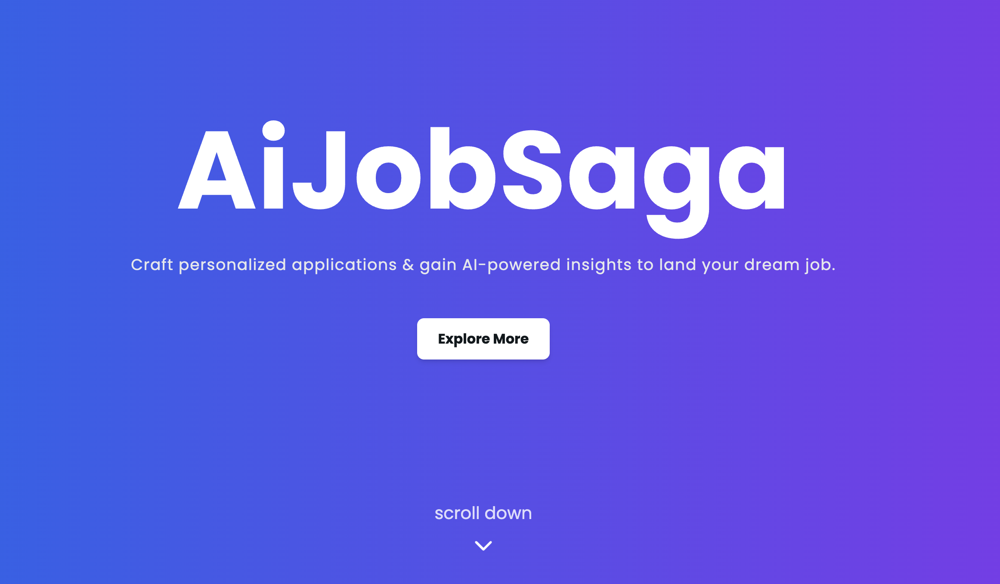

# AIJobSaga

AIJobSaga is a platform designed to connect AI professionals with job opportunities and resources in the field of Artificial Intelligence.

## Table of Contents

- [Introduction](#introduction)
- [Features](#features)
- [Getting Started](#getting-started)
  - [Prerequisites](#prerequisites)
  - [Installation](#installation)
  - [Environment Variables](#environment-variables)
- [Usage](#usage)
- [Contributing](#contributing)
- [License](#license)

## Introduction

AIJobSaga is a comprehensive platform aimed at AI professionals, providing job listings, workspace management, and community engagement features in one place. It streamlines the job search process and enhances professional networking within the AI industry.

## Features

- **Personalized Messages**: Write standout job applications with AI-powered message creation.
- **AI-Generated Insights**: Get data-driven recommendations to optimize your resume & cover letter.
- **Job Fit Score**: See how well your skills match specific job postings.

## Getting Started

Follow these instructions to get a copy of the project up and running on your local machine for development and testing purposes.

### Prerequisites

Ensure you have the following installed on your local machine:

- Node.js (version)
- npm or yarn
- MongoDB (community edition)

### Installation

Clone the repository and navigate into the project directory:

```bash
git clone https://github.com/rohan-kulkarni-25/aijobsaga.git
cd aijobsaga
```

#### Client Setup

Navigate to the client directory and install dependencies:

```bash
cd client
npm install  # or yarn install
```

#### Server Setup

Navigate to the server directory and install dependencies:

```bash
cd ../server
npm install  # or yarn install
```

### Environment Variables

Create a `.env` file in the `server` directory and configure it based on the `.env.sample` file provided:

```bash
cp server/.env.sample server/.env
```

Update the `.env` file with your MongoDB connection string, API keys, or any other environment-specific variables required by your application.

## Usage

To run the application in a development environment:

### Start Client

From the `client` directory, start the Vite development server:

```bash
cd client
npm run dev  # or yarn dev
```

### Start Server

From the `server` directory, start the Express server:

```bash
cd server
npm run start  # or yarn start
```

Open your browser and navigate to `http://localhost:3000` to access the AIJobSaga platform.

## Contributing

Contributions to AIJobSaga are welcome! Please follow our [Contribution Guidelines](CONTRIBUTING.md) to contribute to the project.

## License

This project is licensed under the MIT License - see the [LICENSE](LICENSE) file for details.
